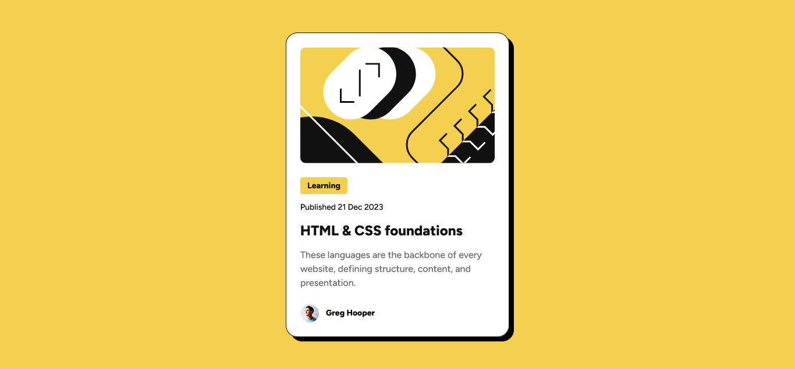
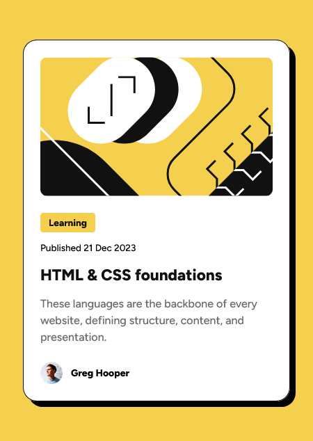
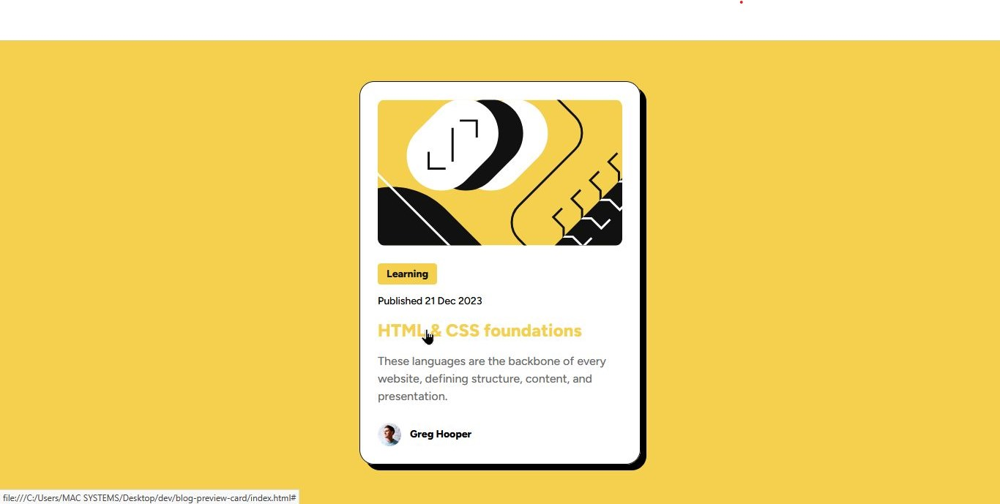

# Frontend Mentor - Blog preview card solution

This is a solution to the [Blog preview card challenge on Frontend Mentor](https://www.frontendmentor.io/challenges/blog-preview-card-ckPaj01IcS). Frontend Mentor challenges help you improve your coding skills by building realistic projects. 

## Table of contents

- [Overview](#overview)
  - [The challenge](#the-challenge)
  - [Screenshots](#screenshots)
  - [Links](#links)
- [My process](#my-process)
  - [Built with](#built-with)
  - [What I learned](#what-i-learned)
- [Author](#author)

## Overview

### The challenge

Users should be able to:

- See hover and focus states for all interactive elements on the page

### Screenshots
Desktop

Mobile

Hover

### Links

- Live Site URL: [Add live site URL here](https://blog-preview-card-gamma-gules.vercel.app/)

## My process

### Built with

- Semantic HTML5 markup
- CSS custom properties
- Flexbox
- Mobile-first workflow

### What I learned

- How to scale image to fill the content box while maintaining its aspect ratio and cropping any parts that overflow, using the CSS properties object-fit(object-fit: cover; to scale and crop image overflow) and object position(object-position: center; to make sure the image is centered after resizing). This is to make the image responsive as specified in the design.
- How to use the css clamp() function to reduce and increase the font sizes for different screen resolutions and make text responsive without media queries.
- Making a flexbox container responsive using flex-grow and flex-shrink, with flex-basis as the base width

## Author

- Frontend Mentor - [@aqueous-humor](https://www.frontendmentor.io/profile/aqueous-humor)
- Twitter - [@Aqueous911](https://www.twitter.com/Aqueous911)
